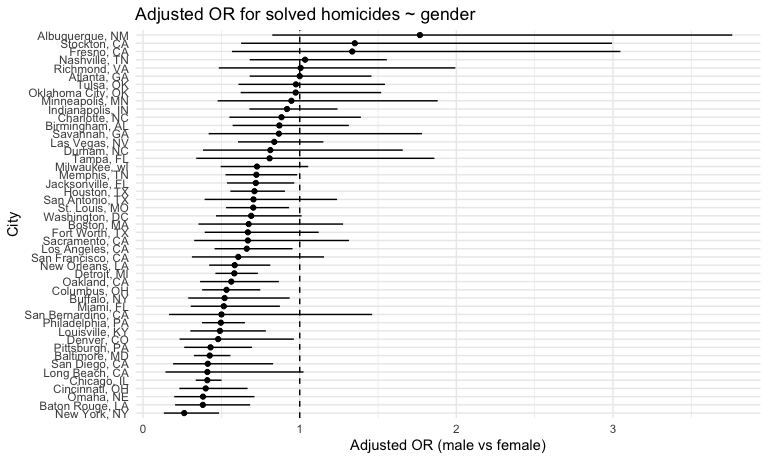
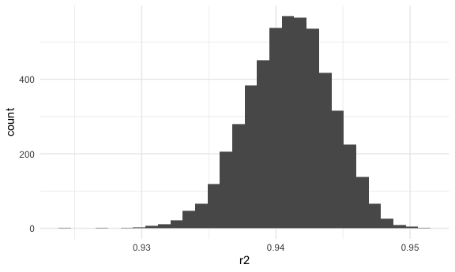
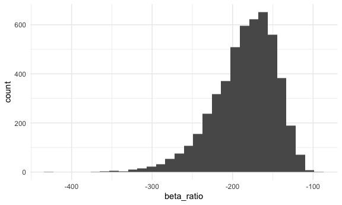
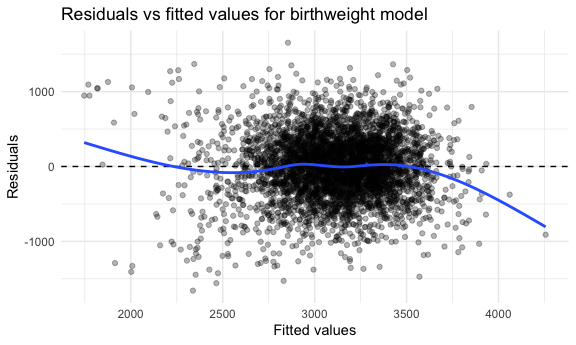

p8105_hw6_cw3747
================
chuhan wang_cw3747
2025-11-25

``` r
library(tidyverse)
```

    ## ── Attaching core tidyverse packages ──────────────────────── tidyverse 2.0.0 ──
    ## ✔ dplyr     1.1.4     ✔ readr     2.1.5
    ## ✔ forcats   1.0.0     ✔ stringr   1.5.1
    ## ✔ ggplot2   3.5.2     ✔ tibble    3.3.0
    ## ✔ lubridate 1.9.4     ✔ tidyr     1.3.1
    ## ✔ purrr     1.1.0     
    ## ── Conflicts ────────────────────────────────────────── tidyverse_conflicts() ──
    ## ✖ dplyr::filter() masks stats::filter()
    ## ✖ dplyr::lag()    masks stats::lag()
    ## ℹ Use the conflicted package (<http://conflicted.r-lib.org/>) to force all conflicts to become errors

``` r
library(patchwork)
library(scales)
```

    ## 
    ## Attaching package: 'scales'
    ## 
    ## The following object is masked from 'package:purrr':
    ## 
    ##     discard
    ## 
    ## The following object is masked from 'package:readr':
    ## 
    ##     col_factor

``` r
library(dplyr)


knitr::opts_chunk$set(
  fig.width = 6,
  fig.asp = .6,
  out.width = "90%"
)

theme_set(theme_minimal() + theme(legend.position = "bottom"))

options(
  ggplot2.continuous.colour = "viridis",
  ggplot2.continuous.fill = "viridis"
)

scale_colour_discrete = scale_colour_viridis_d
scale_fill_discrete = scale_fill_viridis_d
```

## Problem 1

### data import

``` r
homicide = read.csv("./homicide-data.csv") |>
  janitor::clean_names()
```

### city state

``` r
homicide_clean =
  homicide |> 
  mutate(
    city_state = str_c(city, ", ", state),
    solved = if_else(disposition == "Closed by arrest", "yes", "no"),
    solved = factor(solved, levels = c("no", "yes")),
    victim_age = if_else(victim_age == "Unknown",
                         NA_real_, as.numeric(victim_age))
  ) |>
  filter(
    !city_state %in% c("Dallas, TX", "Phoenix, AZ", "Kansas City, MO", 
                       "Tulsa, AL"),
    victim_race %in% c("White", "Black")
  )
```

    ## Warning: There was 1 warning in `mutate()`.
    ## ℹ In argument: `victim_age = if_else(victim_age == "Unknown", NA_real_,
    ##   as.numeric(victim_age))`.
    ## Caused by warning in `if_else()`:
    ## ! NAs introduced by coercion

### baltimore and regression

``` r
library(broom)

baltimore =
  homicide_clean |>
  filter(city_state == "Baltimore, MD")

fit_baltimore =                 ## the output of glm
  glm(
    solved ~ victim_age + victim_sex + victim_race,
    data = baltimore,
    family = binomial
  )

tidy_baltimore =
  tidy(
    fit_baltimore,
    exponentiate = TRUE,
    conf.int    = TRUE
  )

tidy_baltimore
```

    ## # A tibble: 4 × 7
    ##   term             estimate std.error statistic  p.value conf.low conf.high
    ##   <chr>               <dbl>     <dbl>     <dbl>    <dbl>    <dbl>     <dbl>
    ## 1 (Intercept)         1.36    0.171        1.81 7.04e- 2    0.976     1.91 
    ## 2 victim_age          0.993   0.00332     -2.02 4.30e- 2    0.987     1.000
    ## 3 victim_sexMale      0.426   0.138       -6.18 6.26e-10    0.324     0.558
    ## 4 victim_raceWhite    2.32    0.175        4.82 1.45e- 6    1.65      3.28

### ORs and CIs for each city

``` r
or_city =
  homicide_clean |>
  group_by(city_state) |>
  nest() |>
  mutate(
    fit = map(
      data,
      ~ glm(
          solved ~ victim_age + victim_sex + victim_race,
          data   = .x,
          family = binomial
        )
    ),
    tidy_res = map(
      fit,
      ~ tidy(.x, exponentiate = TRUE, conf.int = TRUE)
    )
  ) |>
  select(city_state, tidy_res) |>
  unnest(tidy_res) |>
  filter(term == "victim_sexMale") |>
  select(
    city_state,
    or_male_vs_female = estimate,
    CI_low  = conf.low,
    CI_high = conf.high,
    p_value = p.value
  ) |> 
  ungroup()
```

    ## Warning: There were 43 warnings in `mutate()`.
    ## The first warning was:
    ## ℹ In argument: `tidy_res = map(fit, ~tidy(.x, exponentiate = TRUE, conf.int =
    ##   TRUE))`.
    ## ℹ In group 1: `city_state = "Albuquerque, NM"`.
    ## Caused by warning:
    ## ! glm.fit: fitted probabilities numerically 0 or 1 occurred
    ## ℹ Run `dplyr::last_dplyr_warnings()` to see the 42 remaining warnings.

``` r
or_city
```

    ## # A tibble: 47 × 5
    ##    city_state      or_male_vs_female CI_low CI_high   p_value
    ##    <chr>                       <dbl>  <dbl>   <dbl>     <dbl>
    ##  1 Albuquerque, NM             1.77   0.825   3.76  1.39 e- 1
    ##  2 Atlanta, GA                 1.00   0.680   1.46  1.000e+ 0
    ##  3 Baltimore, MD               0.426  0.324   0.558 6.26 e-10
    ##  4 Baton Rouge, LA             0.381  0.204   0.684 1.65 e- 3
    ##  5 Birmingham, AL              0.870  0.571   1.31  5.11 e- 1
    ##  6 Boston, MA                  0.674  0.353   1.28  2.26 e- 1
    ##  7 Buffalo, NY                 0.521  0.288   0.936 2.90 e- 2
    ##  8 Charlotte, NC               0.884  0.551   1.39  6.00 e- 1
    ##  9 Chicago, IL                 0.410  0.336   0.501 1.86 e-18
    ## 10 Cincinnati, OH              0.400  0.231   0.667 6.49 e- 4
    ## # ℹ 37 more rows

### plots

``` r
library(ggplot2)
library(forcats)

or_city |>
  mutate(
    city_state = fct_reorder(city_state, or_male_vs_female)
  ) |> 
  ggplot(aes(x = or_male_vs_female, y = city_state)) +
  geom_point() +
  geom_errorbar(aes(xmin = CI_low, xmax = CI_high), width = 0) +
  geom_vline(xintercept = 1, linetype = 2) +
  labs(
    x = "Adjusted OR (male vs female)",
    y = "City",
    title = "Adjusted OR for solved homicides ~ gender"
  )
```



Interpretation:

The plot displays the adjusted odds ratio for a homicide being solved
when the victim is male compared with female, controlling for victim age
and race for each city.

In most cities the point estimate is below 1, suggesting that cases with
male victims generally have lower odds of being solved than cases with
female victims, after adjustment for the other covariates.

In several cities near the bottom of the plot (e.g., New York, Baton
Rouge, Omaha), the 95% confidence intervals lie entirely below 1,
indicating a statistically significant disadvantage for male victims.
For many cities in the middle of the figure, the confidence intervals
include 1, so we cannot rule out no difference between male and female
victims. A few cities at the top have odds ratios above 1, but their
intervals are wide, reflecting substantial uncertainty. Overall, the
plot suggests both a tendency toward lower clearance for male victims
and considerable variation across cities.

## Problem 2

### data import

``` r
library(p8105.datasets)
data("weather_df")

janitor::clean_names(weather_df)
```

    ## # A tibble: 2,190 × 6
    ##    name           id          date        prcp  tmax  tmin
    ##    <chr>          <chr>       <date>     <dbl> <dbl> <dbl>
    ##  1 CentralPark_NY USW00094728 2021-01-01   157   4.4   0.6
    ##  2 CentralPark_NY USW00094728 2021-01-02    13  10.6   2.2
    ##  3 CentralPark_NY USW00094728 2021-01-03    56   3.3   1.1
    ##  4 CentralPark_NY USW00094728 2021-01-04     5   6.1   1.7
    ##  5 CentralPark_NY USW00094728 2021-01-05     0   5.6   2.2
    ##  6 CentralPark_NY USW00094728 2021-01-06     0   5     1.1
    ##  7 CentralPark_NY USW00094728 2021-01-07     0   5    -1  
    ##  8 CentralPark_NY USW00094728 2021-01-08     0   2.8  -2.7
    ##  9 CentralPark_NY USW00094728 2021-01-09     0   2.8  -4.3
    ## 10 CentralPark_NY USW00094728 2021-01-10     0   5    -1.6
    ## # ℹ 2,180 more rows

``` r
weather_clean =
  weather_df |>
  select(tmax, tmin, prcp) |>
  drop_na()
```

``` r
library(modelr)
```

    ## 
    ## Attaching package: 'modelr'

    ## The following object is masked from 'package:broom':
    ## 
    ##     bootstrap

``` r
library(broom)

set.seed(1)

boot_results = 
  weather_clean |>
  modelr::bootstrap(n = 5000) |>
  mutate(
    model = map(
      strap,
      ~ lm(tmax ~ tmin + prcp, data = .x)
    ),
    model_sum = map(model, glance),
    coef_tbl = map(model, tidy)
  ) |>
  mutate(
    r2 = map_dbl(model_sum, "r.squared"),
    beta_ratio = map_dbl(coef_tbl, ~ {
      b1 = .x |>
        filter(term == "tmin") |>
        pull(estimate)
      b2 = .x %>% 
        filter(term == "prcp") |>
        pull(estimate) 
      b1 / b2
    })
  ) |>
  select(.id, r2, beta_ratio)
```

### plots

``` r
boot_results |>
  ggplot(aes(x = r2)) +
  geom_histogram(bins = 30)
```



``` r
boot_results |>
  ggplot(aes(x = beta_ratio)) +
  geom_histogram(bins = 30)
```



Interpretation:

For $R^2$, the bootstrap distribution is approximately symmetric and
bell–shaped, with a single prominent mode around $0.94$. The resampled
$R^2$ values are highly concentrated, mostly lying between about $0.93$
and $0.95$, indicating that the fitted multiple linear regression model
consistently explains a large proportion of the variability in $tmax$.

For the ratio $\hat\beta_1 / \hat\beta_2$, the bootstrap distribution is
unimodal but clearly right–skewed on the negative scale, with a peak
near $-200$ and a longer tail extending toward more negative values
(approximately down to about $-400$). This suggests greater variability
and asymmetry in the sampling distribution of the ratio of the two slope
coefficients compared with $R^2$.

### CI

``` r
boot_ci <- boot_results |>
  summarise(
    r2_low   = quantile(r2, 0.025),
    r2_high  = quantile(r2, 0.975),
    br_low   = quantile(beta_ratio, 0.025),
    br_high  = quantile(beta_ratio, 0.975)
  )

boot_ci
```

    ## # A tibble: 1 × 4
    ##   r2_low r2_high br_low br_high
    ##    <dbl>   <dbl>  <dbl>   <dbl>
    ## 1  0.934   0.947  -275.   -125.

The 95% bootstrap confidence interval for $R^2$ is
$\left[\,0.934,\ 0.947\right]$.

The 95% bootstrap confidence interval for $\hat\beta_1 / \hat\beta_2$ is
$\left[\,-274.79,\ -125.48\right]$.

## Problem3

### data import

``` r
bw = read.csv("./birthweight.csv") |>
  janitor::clean_names()
```

``` r
bw |> 
  dplyr::glimpse()
```

    ## Rows: 4,342
    ## Columns: 20
    ## $ babysex  <int> 2, 1, 2, 1, 2, 1, 2, 2, 1, 1, 2, 1, 2, 1, 1, 2, 1, 2, 2, 2, 1…
    ## $ bhead    <int> 34, 34, 36, 34, 34, 33, 33, 33, 36, 33, 35, 35, 35, 36, 35, 3…
    ## $ blength  <int> 51, 48, 50, 52, 52, 52, 46, 49, 52, 50, 51, 51, 48, 53, 51, 4…
    ## $ bwt      <int> 3629, 3062, 3345, 3062, 3374, 3374, 2523, 2778, 3515, 3459, 3…
    ## $ delwt    <int> 177, 156, 148, 157, 156, 129, 126, 140, 146, 169, 130, 146, 1…
    ## $ fincome  <int> 35, 65, 85, 55, 5, 55, 96, 5, 85, 75, 55, 55, 75, 75, 65, 75,…
    ## $ frace    <int> 1, 2, 1, 1, 1, 1, 2, 1, 1, 2, 1, 1, 1, 1, 1, 2, 1, 1, 1, 2, 1…
    ## $ gaweeks  <dbl> 39.9, 25.9, 39.9, 40.0, 41.6, 40.7, 40.3, 37.4, 40.3, 40.7, 4…
    ## $ malform  <int> 0, 0, 0, 0, 0, 0, 0, 0, 0, 0, 0, 0, 0, 0, 0, 0, 0, 0, 0, 0, 0…
    ## $ menarche <int> 13, 14, 12, 14, 13, 12, 14, 12, 11, 12, 13, 12, 13, 11, 12, 1…
    ## $ mheight  <int> 63, 65, 64, 64, 66, 66, 72, 62, 61, 64, 67, 62, 64, 68, 62, 6…
    ## $ momage   <int> 36, 25, 29, 18, 20, 23, 29, 19, 13, 19, 23, 16, 28, 23, 21, 1…
    ## $ mrace    <int> 1, 2, 1, 1, 1, 1, 2, 1, 1, 2, 1, 1, 1, 1, 1, 2, 1, 1, 1, 2, 1…
    ## $ parity   <int> 3, 0, 0, 0, 0, 0, 0, 0, 0, 0, 0, 0, 0, 0, 0, 0, 0, 0, 0, 0, 0…
    ## $ pnumlbw  <int> 0, 0, 0, 0, 0, 0, 0, 0, 0, 0, 0, 0, 0, 0, 0, 0, 0, 0, 0, 0, 0…
    ## $ pnumsga  <int> 0, 0, 0, 0, 0, 0, 0, 0, 0, 0, 0, 0, 0, 0, 0, 0, 0, 0, 0, 0, 0…
    ## $ ppbmi    <dbl> 26.27184, 21.34485, 23.56517, 21.84508, 21.02642, 18.60030, 1…
    ## $ ppwt     <int> 148, 128, 137, 127, 130, 115, 105, 119, 105, 145, 110, 115, 1…
    ## $ smoken   <dbl> 0.000, 0.000, 1.000, 10.000, 1.000, 0.000, 0.000, 0.000, 0.00…
    ## $ wtgain   <int> 29, 28, 11, 30, 26, 14, 21, 21, 41, 24, 20, 31, 23, 21, 24, 2…

``` r
  summary(bw)
```

    ##     babysex          bhead          blength           bwt           delwt      
    ##  Min.   :1.000   Min.   :21.00   Min.   :20.00   Min.   : 595   Min.   : 86.0  
    ##  1st Qu.:1.000   1st Qu.:33.00   1st Qu.:48.00   1st Qu.:2807   1st Qu.:131.0  
    ##  Median :1.000   Median :34.00   Median :50.00   Median :3132   Median :143.0  
    ##  Mean   :1.486   Mean   :33.65   Mean   :49.75   Mean   :3114   Mean   :145.6  
    ##  3rd Qu.:2.000   3rd Qu.:35.00   3rd Qu.:51.00   3rd Qu.:3459   3rd Qu.:157.0  
    ##  Max.   :2.000   Max.   :41.00   Max.   :63.00   Max.   :4791   Max.   :334.0  
    ##     fincome          frace          gaweeks         malform        
    ##  Min.   : 0.00   Min.   :1.000   Min.   :17.70   Min.   :0.000000  
    ##  1st Qu.:25.00   1st Qu.:1.000   1st Qu.:38.30   1st Qu.:0.000000  
    ##  Median :35.00   Median :2.000   Median :39.90   Median :0.000000  
    ##  Mean   :44.11   Mean   :1.655   Mean   :39.43   Mean   :0.003455  
    ##  3rd Qu.:65.00   3rd Qu.:2.000   3rd Qu.:41.10   3rd Qu.:0.000000  
    ##  Max.   :96.00   Max.   :8.000   Max.   :51.30   Max.   :1.000000  
    ##     menarche        mheight          momage         mrace      
    ##  Min.   : 0.00   Min.   :48.00   Min.   :12.0   Min.   :1.000  
    ##  1st Qu.:12.00   1st Qu.:62.00   1st Qu.:18.0   1st Qu.:1.000  
    ##  Median :12.00   Median :63.00   Median :20.0   Median :2.000  
    ##  Mean   :12.51   Mean   :63.49   Mean   :20.3   Mean   :1.627  
    ##  3rd Qu.:13.00   3rd Qu.:65.00   3rd Qu.:22.0   3rd Qu.:2.000  
    ##  Max.   :19.00   Max.   :77.00   Max.   :44.0   Max.   :4.000  
    ##      parity            pnumlbw     pnumsga      ppbmi            ppwt      
    ##  Min.   :0.000000   Min.   :0   Min.   :0   Min.   :13.07   Min.   : 70.0  
    ##  1st Qu.:0.000000   1st Qu.:0   1st Qu.:0   1st Qu.:19.53   1st Qu.:110.0  
    ##  Median :0.000000   Median :0   Median :0   Median :21.03   Median :120.0  
    ##  Mean   :0.002303   Mean   :0   Mean   :0   Mean   :21.57   Mean   :123.5  
    ##  3rd Qu.:0.000000   3rd Qu.:0   3rd Qu.:0   3rd Qu.:22.91   3rd Qu.:134.0  
    ##  Max.   :6.000000   Max.   :0   Max.   :0   Max.   :46.10   Max.   :287.0  
    ##      smoken           wtgain      
    ##  Min.   : 0.000   Min.   :-46.00  
    ##  1st Qu.: 0.000   1st Qu.: 15.00  
    ##  Median : 0.000   Median : 22.00  
    ##  Mean   : 4.145   Mean   : 22.08  
    ##  3rd Qu.: 5.000   3rd Qu.: 28.00  
    ##  Max.   :60.000   Max.   : 89.00

``` r
  colSums(is.na(bw))
```

    ##  babysex    bhead  blength      bwt    delwt  fincome    frace  gaweeks 
    ##        0        0        0        0        0        0        0        0 
    ##  malform menarche  mheight   momage    mrace   parity  pnumlbw  pnumsga 
    ##        0        0        0        0        0        0        0        0 
    ##    ppbmi     ppwt   smoken   wtgain 
    ##        0        0        0        0

``` r
bw =
  bw |>
  dplyr::mutate(
    babysex = factor(babysex, levels = c(1, 2),
                     labels = c("male", "female")),
    frace  = factor(frace,  levels = c(1,2,3,4,8,9),
                    labels = c("white","black","asian",
                               "puerto_rican","other","unknown")),
    mrace  = factor(mrace,  levels = c(1,2,3,4,8),
                    labels = c("white","black","asian",
                               "puerto_rican","other")),
    malform = factor(malform, levels = c(0,1),
                     labels = c("absent","present"))
  )
```

### MLR

``` r
mlr_bw =
  lm(
    bwt ~ gaweeks + ppbmi + wtgain + smoken + babysex + mrace + parity + 
      pnumlbw + pnumsga, 
    data = bw
  )

mlr_bw
```

    ## 
    ## Call:
    ## lm(formula = bwt ~ gaweeks + ppbmi + wtgain + smoken + babysex + 
    ##     mrace + parity + pnumlbw + pnumsga, data = bw)
    ## 
    ## Coefficients:
    ##       (Intercept)            gaweeks              ppbmi             wtgain  
    ##           553.629             54.388             20.057              9.764  
    ##            smoken      babysexfemale         mraceblack         mraceasian  
    ##           -11.546            -85.688           -297.536           -126.607  
    ## mracepuerto_rican             parity            pnumlbw            pnumsga  
    ##          -186.311            102.541                 NA                 NA

``` r
summary(mlr_bw)
```

    ## 
    ## Call:
    ## lm(formula = bwt ~ gaweeks + ppbmi + wtgain + smoken + babysex + 
    ##     mrace + parity + pnumlbw + pnumsga, data = bw)
    ## 
    ## Residuals:
    ##      Min       1Q   Median       3Q      Max 
    ## -1657.93  -263.74     5.69   274.12  1653.19 
    ## 
    ## Coefficients: (2 not defined because of singularities)
    ##                    Estimate Std. Error t value Pr(>|t|)    
    ## (Intercept)        553.6295    94.1741   5.879 4.44e-09 ***
    ## gaweeks             54.3884     2.1281  25.557  < 2e-16 ***
    ## ppbmi               20.0570     2.0669   9.704  < 2e-16 ***
    ## wtgain               9.7640     0.6045  16.153  < 2e-16 ***
    ## smoken             -11.5462     0.9067 -12.735  < 2e-16 ***
    ## babysexfemale      -85.6883    13.0104  -6.586 5.05e-11 ***
    ## mraceblack        -297.5360    14.1546 -21.020  < 2e-16 ***
    ## mraceasian        -126.6070    66.2419  -1.911    0.056 .  
    ## mracepuerto_rican -186.3110    29.1762  -6.386 1.89e-10 ***
    ## parity             102.5407    63.2636   1.621    0.105    
    ## pnumlbw                  NA         NA      NA       NA    
    ## pnumsga                  NA         NA      NA       NA    
    ## ---
    ## Signif. codes:  0 '***' 0.001 '**' 0.01 '*' 0.05 '.' 0.1 ' ' 1
    ## 
    ## Residual standard error: 427.3 on 4332 degrees of freedom
    ## Multiple R-squared:  0.3053, Adjusted R-squared:  0.3038 
    ## F-statistic: 211.5 on 9 and 4332 DF,  p-value: < 2.2e-16

$$
\widehat{\text{bwt}} =
553.6 + 54.4\,\text{gaweeks} + 20.1\,\text{ppbmi} + 9.8\,\text{wtgain} - 11.5\,\text{smoken} - 85.7\,\mathbb{I}(\text{babysex}=\text{female}) - 297.5\,\mathbb{I}(\text{mrace}=\text{black}) - 126.6\,\mathbb{I}(\text{mrace}=\text{asian}) - 186.3\,\mathbb{I}(\text{mrace}=\text{puerto\_rican}) + 102.5\,\text{parity}
$$

We fitted a multiple linear regression model with birthweight in grams
as the outcome and gestational age, maternal pre-pregnancy BMI, maternal
weight gain during pregnancy, daily number of cigarettes smoked, infant
sex, maternal race, and parity as predictors.

After adjustment for all other variables in the model, birthweight is
positively associated with gestational age, maternal BMI, weight gain,
and parity, and negatively associated with cigarette smoking. Infants
born to mothers who are Black or Puerto Rican tend to have lower
birthweights compared with those born to White mothers, and female
infants tend to weigh less than male infants. Overall, the model
captures biologically plausible relationships between fetal growth and
maternal characteristics, smoking behavior, and sociodemographic
factors.

### plots

``` r
bw_resid =
  bw |>
  modelr::add_predictions(mlr_bw) |>
  modelr::add_residuals(mlr_bw)

bw_resid |>
  ggplot(aes(x = pred, y = resid)) + 
  geom_point(alpha = 0.3) + 
  geom_hline(yintercept = 0, 
             linetype = "dashed") +
  geom_smooth(se = FALSE) +
  labs(
    x = "Fitted values", 
    y = "Residuals",
    title = "Residuals vs fitted values for birthweight model"
  )
```

    ## `geom_smooth()` using method = 'gam' and formula = 'y ~ s(x, bs = "cs")'



Process

I used multiple linear regression with birthweight in grams as the
outcome. After cleaning the data and turning sex and race into factor
variables, I chose predictors that are biologically related to fetal
growth: gestational age, maternal pre-pregnancy BMI, weight gain during
pregnancy, number of cigarettes smoked per day, infant sex, maternal
race, and parity. I first fit a full model including these variables
plus indicators for previous low-birthweight and SGA infants. Because
the previous low-birthweight/SGA variables were perfectly collinear with
the others, R dropped them due to singularities, and the remaining
predictors form the final model used for all diagnostics.

Interpretation

In the residuals versus fitted values plot, the points are roughly
centered around zero across the range of fitted birthweights, and the
spread of residuals is fairly constant, so the mean-zero and
constant-variance assumptions look reasonable. The smooth curve stays
close to zero in the middle but bends slightly downward at the very low
and very high fitted values, suggesting some mild lack of fit at the
extremes; overall, the linear model describes the bulk of the data
reasonably well.
